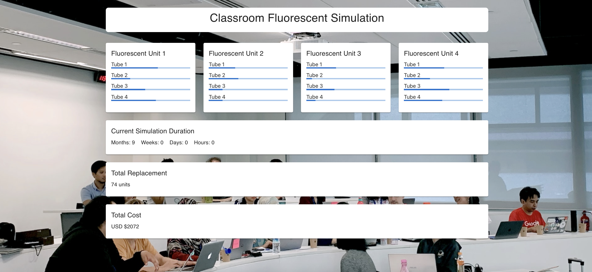

# Fluorescent Simulation

This repository contains a simulation algorithm for managing fluorescent tubes in a university classroom. The simulation is implemented using React TypeScript for the frontend and Ruby for the backend. Docker and Docker Compose are used to simplify the setup process.

## Screenshots

### Desktop View



### Mobile View


## Getting Started

Follow these steps to set up and run the simulation on your local machine.

### Prerequisites

Make sure you have Docker and Docker Compose installed on your system.

* Docker Installation
* Docker Compose Installation

### Clone the Repository

```bash
git clone https://github.com/realcc/fluorescent
cd fluorescent
```

### Initialize the Database

```bash
docker-compose run backend bin/rails db:create db:migrate
```

### Run the Application

Start the application using Docker Compose:

```bash
docker-compose up -d
```

The website can be accessed via http://localhost

## Simulation Algorithm

The simulation algorithm addresses the following problem:

In a University classroom with 4 fluorescent tube units, each containing 4 fluorescent tubes, and the classroom being used 15 hours a day, 5 times a week, 9 months a year, the algorithm calculates the following:

* How many fluorescent tubes were broken in 1 year in that classroom?
* How much money do fluorescent tubes cost the University per year per classroom?

### Problem Details

* Each fluorescent tube works for a fixed amount of hours, determined by the function rand(), which returns an integer number from 100 to 200, representing the number of hours the tube will work before breaking.
* Once 2 fluorescent tubes fail in a single unit, all 4 tubes in that unit should be replaced.
* The cost of each fluorescent tube is $7 USD.

The algorithm provides the necessary insights and cost analysis based on the simulated scenario.
